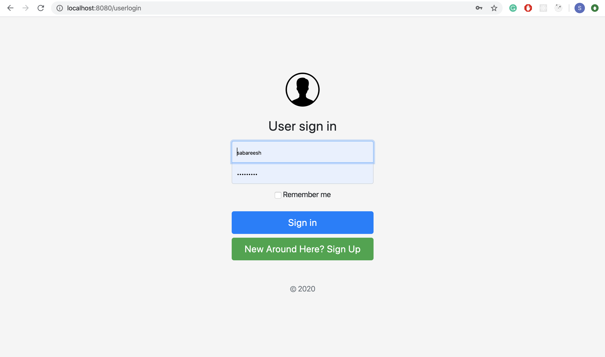
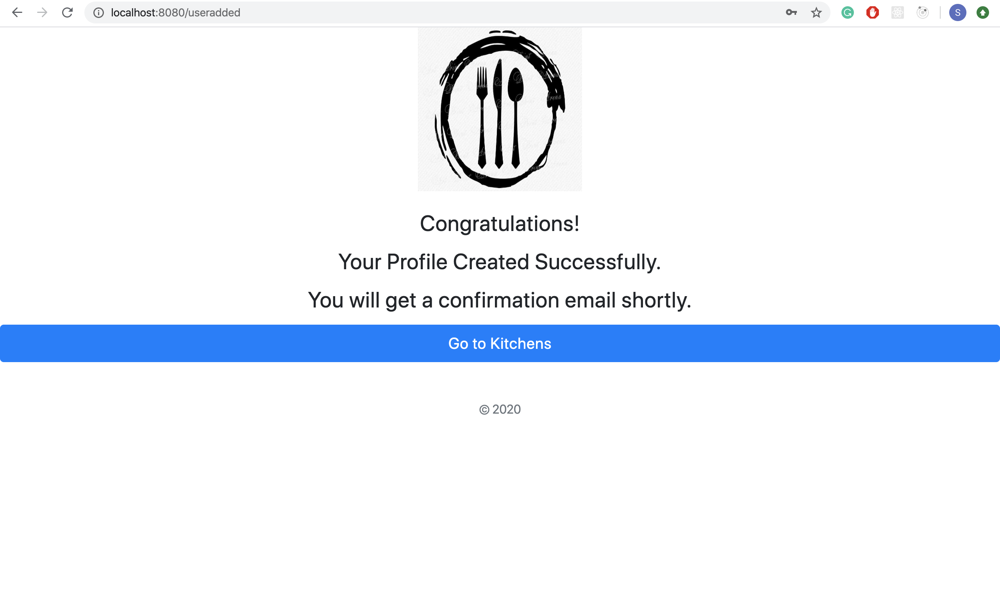
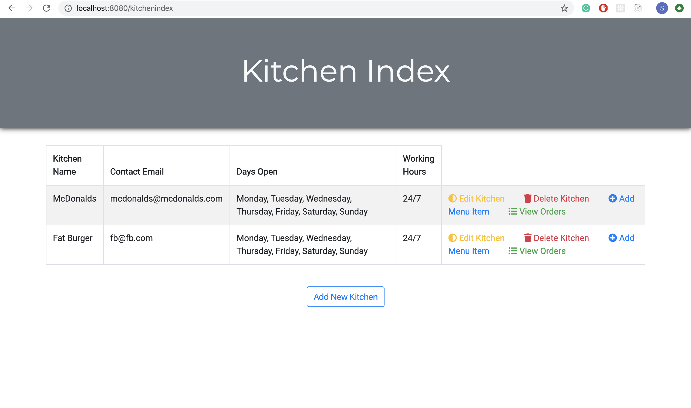

# Feast Freedom

## Check The Application out here [here](http://54.210.233.136:8080/Feast_Freedom/).

## Description

A web application similar to mainstream applications like GrubHub, UberEats and EatStreet. The Application gives Restaurants(Kitchens) and Users separate portals in which they can register. Once registered, Kitchens will become available for users to order from once they have successfully registered as well.

## Project Structure

### Backend

The basic structure out application follows is SpringBoot MVC. We decided to use MongoDB to store all of our persistent data. The reason we chose Mongo over MySQL for this project is that this is a new project and our data can ultimately be expanded with more embedded objects which would make MongoDB a better choice since it is more flexible. Also, we were trying to keep simplicity as a high priority since we technically only had 4.5 - 5 days in office to complete the project. We felt like eliminating the need of joins in SQL would really help since Mongo data is all stored as JSON, in which data is easily embedded and accessed without any joins. Users, Kitchens and Menu Items for each Kitchen are stored in separate collections within our MongoDB which is hosted on cloud using Mongo Atlas. We utilized a basic Linux server on AWS and installed MongoDB and Tomcat on it. Mongo Atlas gives us easy access and organized control of the database using a very strong GUI tool.

### Frontend

Unfortunately, with the limited frontend options available to use for this project we had to make the best out of HTML, Bootstrap and Thyme leaf. We plan on converting the frontend of this project to React since it is much more efficient and newer in the industry. We were still able to achieve creating beautiful pages, however tying in some of the persistent data gave us some trouble. These fixes will be made as the application is converted to having a React front end as many of these problems are easily solved using React.

## Project Plan

## Application Flow

### Home Page

### Kitchen Login/Signup Pages

### User Login/Signup Pages

### Kitchen Added Confirmation Page

### User Added Confirmation Page

### Kitchen Index Page

### User Index Page

### Adding A Menu Item To Kitchen

### Placing An Order From Kitchen

### Order Confirmation Page (With Automated Email)

## Upcoming Updates:
 * Convert Front End To React
 * OAuth2 Signup/Login for users using third parties such as Facebook, Twitter, Google etc 
 * Fully Functional Cart and Payment system

## Key Technologies Used
 * Java 8
 * SpringBoot 2.2
 * MongoDB
 * Mongo Atlas
 * AWS Linux Server
 * Tomcat
 * Bootstrap 4
 * HTML
 * Thymeleaf

## Contributors
 * Rishabh Goel
 * Sabareesh Govindarajan
 * Mostafa Beais

